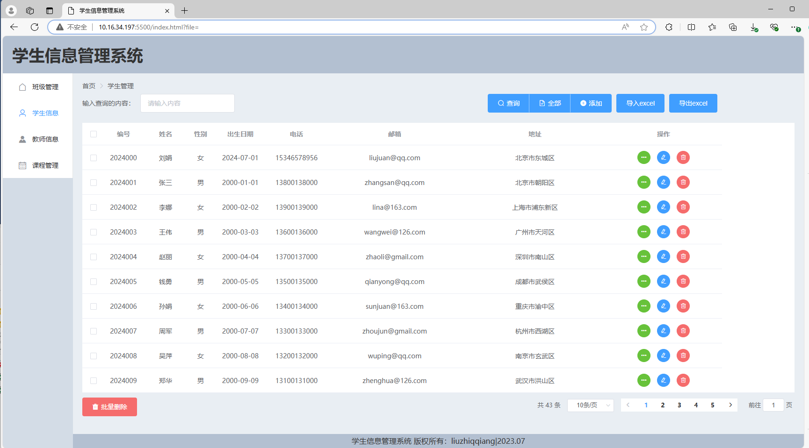

# 这是一个关于学生信息管理的系统

包括增、删、改、查、导入、导出等功能。

## 具体实现

### MySQL8+Python+Django+Vue2+Element

- 前端使用Vye2 + Element UI实现页面展示

- 后端使用Python + Django实现后端数据接口
- 基于ORM模型操作数据库
- 前端使用Axios和后端接口交互数据

## 整体效果

## 文件结构

~~~data
-StudentBE——后端
	-apps——用于存放app的，比如简易版本就是student
		-models——用于配置数据库
		-views——用于存放后端函数
	-media——用于存放头像图片、导入导出的excel
	-StudentBE
		-settings——用于存放基础配置
		-urls——用于存放路径接口

-StudentFE——前端
	-index.html——用来展示网页
	-css——存放style
	-js——存放Vue
~~~

